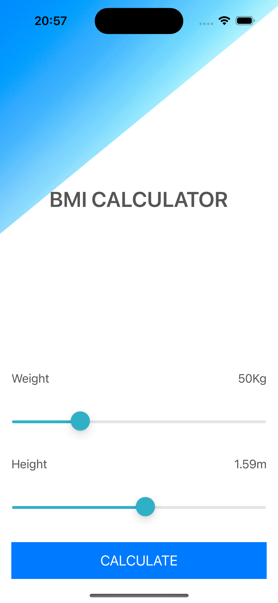
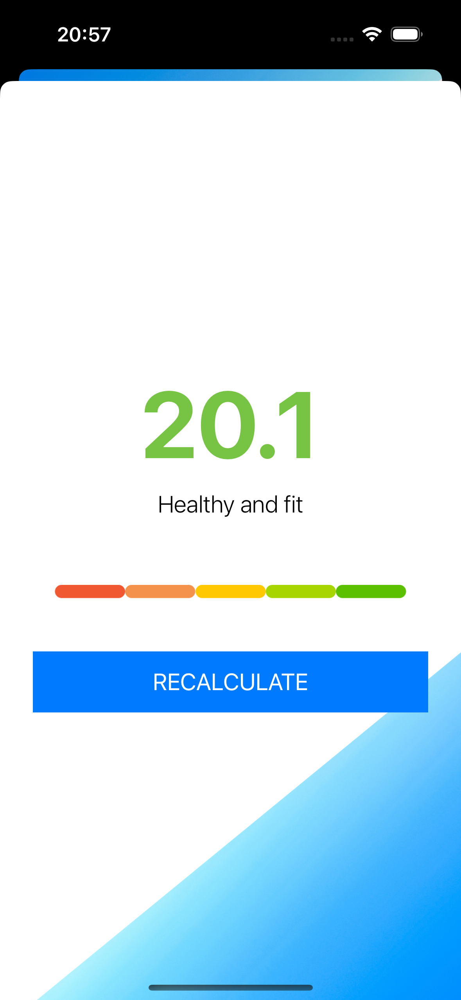

# BMI Calculator App 📱

The BMI Calculator App is an iOS application built from scratch using Swift. With just a few lines of code, it calculates the user's BMI based on their weight and height. Additionally, it provides health advice based on the calculated result.

## Key Features 🔑

The BMI Calculator App offers the following features:

- Calculation of BMI based on user's weight and height.
- Presentation of health advice based on the calculated BMI.

## Key Skills and Concepts Learned 🧠

During the development of the BMI Calculator App, you will gain experience in the following key skills and concepts:

- Creating multi-screen apps with animated navigation.
- Utilizing optional binding, optional chaining, and the nil coalescing operator.
- Understanding the difference between structs and classes.
- Formatting strings to display information in a user-friendly manner.
- Incorporating color literals for visually appealing interface elements.
- Working with stacks to organize and align views effectively.
- Utilizing segues for seamless navigation between screens.
- Implementing the Model-View-Controller (MVC) design pattern to create a scalable and maintainable codebase.

## How to Use 📲

To use the BMI Calculator App, follow these steps:

1. Open the app on your iOS device.

2. Enter your weight and height in the provided fields.

3. Tap the "Calculate" button to obtain your BMI.

4. The app will display your BMI and provide health advice based on the result.

## Requirements ⚙️

The BMI Calculator App requires the following:

- iOS device running iOS 13.0 or above.

## Screenshots 📷

